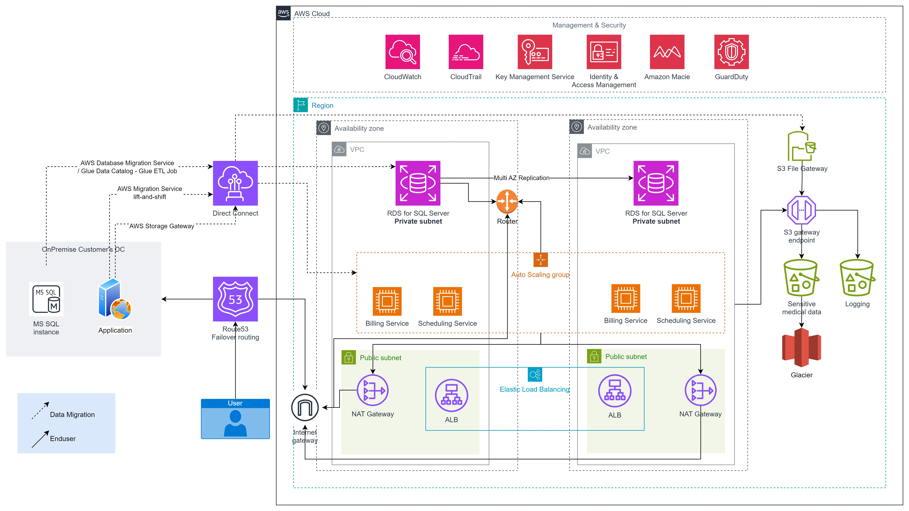

# aws-tf-healthcare

## 1. Introduction
### 1.1. Overview Project Objective
A healthcare provider is planning to migrate their on-premises infrastructure to AWS. They currently use SQL Server for patient records, along with on-premise applications for billing and scheduling. Local storage contains sensitive medical data. Security and compliance with healthcare regulations (such as HIPAA) are the top priorities. Additionally, the provider requires a disaster recovery (DR) solution and a scalable architecture for future growth.

### 1.2. High Level Architect
This architecture provides the healthcare provider with a secure, scalable, and compliant cloud environment for hosting their critical applications and sensitive medical data.

